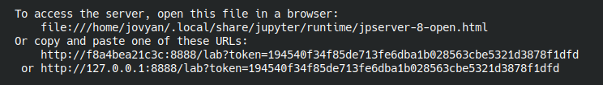
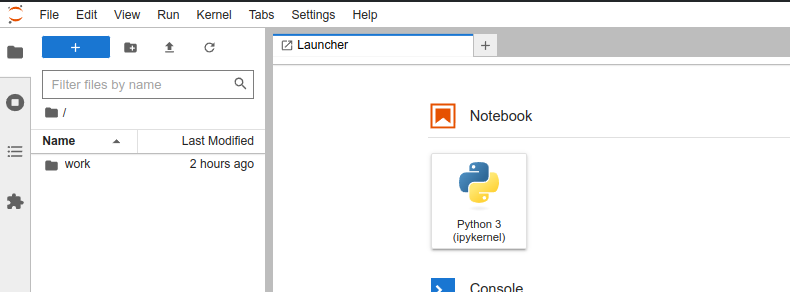

# Motivation

This project provides an local execution environment for Qiskit simulator and frontend for IBM quantum computers i.e. a local alternative to 
[IBM Quantum Lab](https://quantum-computing.ibm.com/).
It uses a [Jupyter Notebook](https://jupyter.org/) as a frontend for [Qiskit simulator](https://qiskit.org/). Both these components are enclosed in a Docker image,
so its installation and de-installation is a breeze.

# How to use it?

* Install [Docker](https://www.docker.com/) on your local machine.
* Run the following
  ```
	docker run --rm --name "qiskit" -ti -v ${PWD}:/home/jovyan/work -p 8888:8888 pzktit/qiskit
	```
* then you will see something like that
  
* Open one of the provided links. You should see Jupyter Notebook web interface. Contents of you local directory is accessible in the ``work`` folder.
  
  
  
Now you can experiment with quantum devices. 

# Usefull links

* [Jupyter Notebooks](https://jupyter.org/) are similar MathCAD or Mathematica interface. [Here you can find a gentle tutorial how to interact with the notebook](https://jupyter-notebook.readthedocs.io/en/latest/).
* [Qiskit Tutorials](https://github.com/Qiskit/qiskit-tutorials) are available on [GitHub](https://github.com/).
  ```
	git clone https://github.com/Qiskit/qiskit-tutorials
	cd qiskit-tutorials/tutorials
	docker run --rm --name "qiskit" -ti -v ${PWD}:/home/jovyan/work -p 8888:8888 pzktit/qiskit
	``` 
	Please use them in the following order: 1) circuits,  2) circuits_advanced,  3) simulators,  4) algorithms,  5) operators,  6) textbook.

# Advanced

You can customize a Qiskit docker image on your own. Please visit [Dockerized Qiskit repository](https://github.com/pzktit/DockerizedQiskit).


